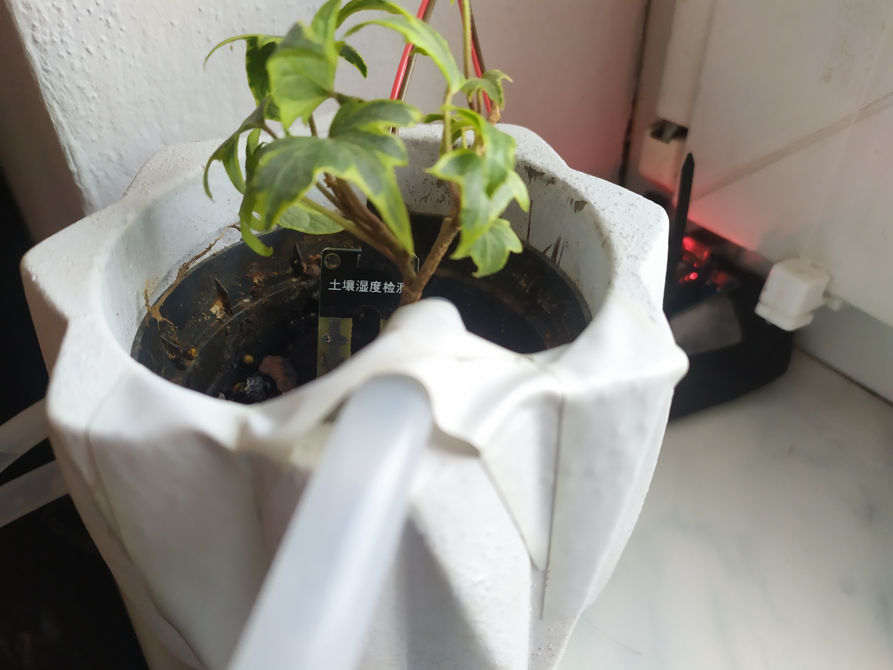
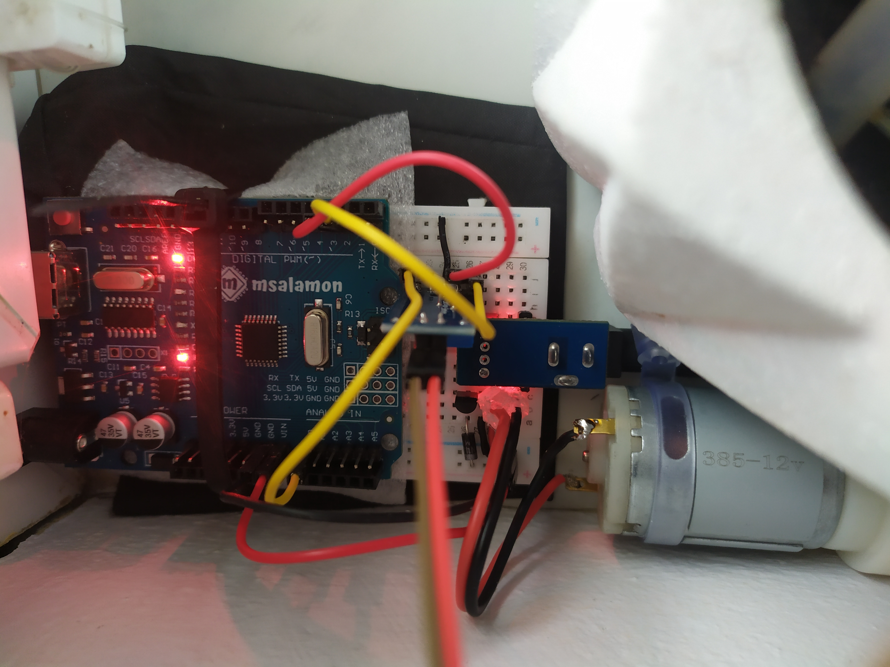

  

<h1 align="center">Automatic Plant Watering System</h1>

  

    An <strong>Automatic Plant Watering System</strong> designed to monitor soil moisture levels and automatically water plants when necessary.  
    This system ensures that plants receive the right amount of water, reducing manual effort and conserving water.
  

  
  

 

  

 

  

<h2 align="center">Features</h2>

- **Monitors soil moisture levels** to determine watering needs.
- **Automatically waters plants** based on predefined thresholds.
- Helps conserve water while reducing manual effort.
